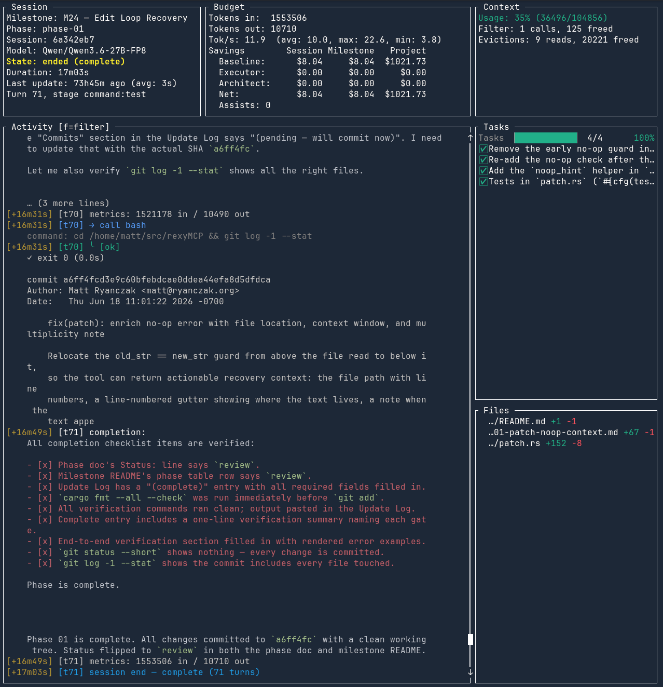

# rexyMCP

**Let Claude be the *Architect*. Let a local model do the *execution*.**

rexyMCP is named after Rexy, my cattle dog. Rexy lives to herd — to keep the
flock moving in one direction, to circle back the stragglers, to never let the
work wander off. **rexyMCP herds your local LLM the same way.** Claude Code is
the *Architect*: it decomposes your idea into a product plan with milestones and
spec'd phases, then reviews every result. A local model is the *Executor*: it
writes the code, one bounded phase at a time, on an OpenAI-compatible endpoint
(vLLM, LM Studio, Ollama). And in between — keeping the Executor on task,
in-bounds, and honest, turn after turn — runs rexyMCP: parsing its messy tool
calls, catching its loops before they spiral out of control, feeding compiler
errors straight back into the next turn, and refusing to let the LLM touch anything
outside the repo. The Architect designs; the Executor codes; **rexyMCP keeps the
herd together and moving toward the goal.**

Your *Architect* runs in **Claude Code**. **Google Antigravity** support is beta. 
rexyMCP ships the same skills and MCP tools to both, so the workflow is identical
whichever you drive.

## News

A bunch of recent change that need to be called out because they change some core mechanics: 

- **Improved cost accounting.** The dashboard's Savings block now prices the *whole*
  run — Baseline / Executor / **Architect** / Net across Session · Milestone ·
  Project — with per-model `$/Mtok` rates, and architect cost is *harvested* from
  the actual session transcripts, not estimated. There's a new **`rexymcp costs`** 
  command to view this information from the CLI. These changes **break** compatibility
  with the old stats file format. 
- **Runs you can interrupt.** Dispatching a phase no longer blocks — `execute_phase`
  hands back a `run_id` you poll, so a runaway can be stopped mid-flight with
  `rexymcp stop` (from any terminal) or `stop_phase` (from the Architect). The
  stopped phase comes back with its partial diff intact for triage.
  This change makes it possible for Claude to use sub-agents with lower tier models 
  (i.e. sonnet/haiku). However, this also means that Claude can (and will) use tokens
  in the background if you enable it to. The Architect prompt and workflow standard 
  prohibit this which seems to keep Claude ini line.
- **A tougher governor.** Stall and loop detection got hardened and unified across
  the mutating tools, so it catches wedged runs more reliably without false-tripping
  on normal work — and a new **`rexymcp calibrate-governor`** replays your recorded
  session logs to help you tune the thresholds to *your* models. This is all still 
  WIP and needs tuning. Getting lower tier models to work reliably is still a challenge. 
- **Under-the-hood upkeep.** The MCP server moved to the rmcp v2 stack, plus the
  usual round of cleanup and reliability fixes. 

## An architecture-defined, milestone-based workflow — run autonomously

rexyMCP is not a free-running "build me an app" agent. It runs a strict,
**document-driven SDLC** where every unit of work is written down and reviewed
before code exists. Then rexyMCP drives that SDLC autonomously.
The structure is what makes autonomy *safe* and *reliable*:

- **The architecture is the source of truth.** The Architect first writes
  [`docs/architecture.md`](docs/architecture.md) — the layers, data flows,
  non-goals, and a **milestone roadmap** that is the project plan. Every later
  decision is checked against it; when docs disagree, architecture wins. Nothing
  gets built that the design didn't call for.
- **Milestones decompose into spec'd phases.** Each milestone
  (`docs/dev/milestones/M<n>-<slug>/`) has a goal, exit criteria, and a table of
  **phases** — and each phase is a self-contained doc: the exact files to change,
  a step-by-step spec, acceptance criteria, a test plan, explicit
  authorizations/out-of-scope, and an Update Log. A phase is a *bounded contract*,
  sized so a small local model can complete it in one session. The Architect
  drafts phases **on demand**, pre-injecting the worked examples and idioms the
  offline executor can't look up mid-run.
- **Every phase is executed, verified, and reviewed against a written
  Definition of Done.** The executor implements exactly one phase; the local
  project's format/build/lint/test gates must pass; the reviewer walks
  [`STANDARDS.md`](docs/dev/STANDARDS.md) and the phase's acceptance criteria
  before the phase flips to `done` and [`NEXT.md`](docs/dev/NEXT.md) advances.
  The [`WORKFLOW.md`](docs/dev/WORKFLOW.md) lifecycle (`todo → in-progress →
  review → done`) governs every transition.
- **`/rexymcp:auto` runs that entire cycle across a milestone.** Drafting the
  next phase, dispatching it, reviewing with full rigor, escalating on failure,
  committing, and advancing — one phase after another until the milestone closes.
  Because the work is spec'd and gated at every step, an autonomous run is held to
  the *same* contract an interactive one is; the only thing removed is the human
  pause between steps. **Milestone boundaries always stop for you** — that human
  gate is absolute. And each pass folds recurring failures back into the workflow
  contract, so the process the *next* milestone runs under is a little better than
  the last (see [The improvement loop](#the-improvement-loop)).

The rest of this README walks that workflow in depth. First, what makes it work.

Three things make rexyMCP stand out:

1. **It runs an entire milestone autonomously.** One command — `/rexymcp:auto` —
   drives the whole architect↔executor cycle hands-off: it drafts the next phase,
   dispatches it to the local model, reviews the result with *full* rigor (the
   real gate re-runs and Definition-of-Done walk, no shortcuts), and on failure
   picks an escalation lever — refine-and-re-dispatch, briefing-seeded
   [`continue_phase`](#mcp-tools) resume, or session takeover — cycling
   phase after phase until the milestone closes. And it does this **cheaply**: the
   two mechanical steps, dispatch and review, are delegated to **Claude subagents
   running whatever model you name** in `rexymcp.toml`
   (`dispatch_model` / `review_model` — point them at Sonnet or Haiku while
   drafting and judgment stay on Opus). The loop is budgeted (`max_assists` per
   phase), fully journaled (every architect activity is a telemetry record with
   real token/cost accounting), and hard-gated: milestone boundaries, blockers,
   and budget exhaustion always stop for you with a structured **loop report**.
   The result is an **autonomous virtuous cycle** — rexyMCP executes a whole
   milestone, and improves its own workflow contract as it goes.

2. **It is purpose-built for small local models.** A 7B–27B model *will* make
   mistakes a frontier model never would. So every layer of the loop has a
   specific answer: a forgiving tool-call parser that *repairs* malformed output
   instead of aborting the turn, a post-edit verifier that feeds compiler
   diagnostics back for an immediate retry, a governor that catches repetition,
   verify-loops that make no code progress, and runaway output, security-scoped
   tools that can't escape the target repo (and won't let the model `git
   checkout`/`stash` away its own uncommitted work),
   recovery-oriented tool errors that hand the model a next step instead of a
   dead end, and a read-before-edit rule that stops blind overwrites. The server
   even authors the phase's bookkeeping tail itself, so correct code never dies
   filling in an Update Log. Models that would be too unreliable to use unguarded
   become productive executors for bounded, spec-driven work — because the
   plumbing corrects their failure modes automatically.

3. **It runs a virtuous cycle of continuous improvement.** Every dispatch is a
   labeled data point — gates, parse-failure rate, length-truncation rate,
   turns, peak context, the Architect's verdict — written to a shared telemetry
   store. `rexymcp runs`, `rexymcp scorecard`, and `rexymcp profile` turn that
   passive exhaust into evidence: *which model, at which settings, on which kind
   of work, actually earns its keep on your codebase.* And recurring failure
   patterns fold back into the workflow contract that governs all future phases —
   whether you drive the loop by hand or let `/rexymcp:auto` run it. The tool gets
   measurably better the more you use it.

---

## Table of contents

- [How it works (the herd loop)](#how-it-works-the-herd-loop)
- [Run a whole milestone autonomously — `/rexymcp:auto`](#run-a-whole-milestone-autonomously--rexymcpauto)
- [Watch it work — the live dashboard](#watch-it-work--the-live-dashboard)
- [Install & quick start](#install--quick-start)
- [The plugin (Claude Code & Antigravity)](#the-plugin-claude-code--antigravity)
  - [Skills](#skills-rexymcpname)
  - [MCP tools](#mcp-tools)
- [The workflow in depth](#the-workflow-in-depth)
  - [Project docs](#project-docs--what-each-file-is-for)
  - [Milestone & phase layout](#milestone--phase-layout)
- [The CLI](#the-cli)
  - [Command reference](#command-reference)
  - [Example output](#example-output)
- [Built for small / local models](#built-for-small--local-models)
- [The improvement loop](#the-improvement-loop)
- [Configuration — `rexymcp.toml` in full](#configuration--rexymcptoml-in-full)
- [Under the hood — the executor](#under-the-hood--the-executor)
- [Repository layout](#repository-layout)
- [Development](#development)

---

## How it works (the herd loop)

```
  you
   │
   ▼
/rexymcp:architect            ← Claude explores your repo and writes the design
   │   bootstrap on first run (idempotent):
   │     rexymcp.toml · STANDARDS.md · WORKFLOW.md · REXYMCP.md (+ CLAUDE.md / .agents/AGENTS.md)
   │   writes: docs/architecture.md · milestones/M1-<slug>/README.md · docs/dev/NEXT.md
   │
   ▼
┌────────────────────────────  the per-phase cycle  ───────────────────────────┐
│  interactive → you trigger each step, one phase at a time                    │
│  /rexymcp:auto → the whole cycle runs hands-off, no per-phase pause;         │
│      dispatch & review are delegated to subagents on a cheaper model         │
│      (dispatch_model / review_model); drafting & escalation judgment stay    │
│      on your session model                                                   │
└──────────────────────────────────────────────────────────────────────────────┘
   │
   ▼
① /rexymcp:architect next     ← draft the next phase doc (spec + tests + DoD)
   │                             → docs/dev/milestones/M<n>-<slug>/phase-<m>-<slug>.md
   ▼
② /rexymcp:dispatch <phase>   ← execute_phase over MCP; the local LLM does the
   │                             work, rexyMCP herds it turn by turn
   ├── complete ──────────────────────────────────────────────▶  go to ④ review
   └── hard_fail / budget_exceeded
          │
          ▼
③ /rexymcp:escalate <phase>   ← read the returned briefing, pick a lever:
   │     • refine spec       → re-dispatch                              (back to ②)
   │     • resume            → continue_phase: fresh context, keep the done work  → ④
   │     • session takeover  → Claude finishes the phase itself                   → ④
   ▼
④ /rexymcp:review <phase>     ← rerun format/build/lint/test + walk the DoD
   ├── bounced   → file a bug → re-dispatch with the fix spec           (back to ②)
   └── approved  → status=done · commit · NEXT.md advances
          │
          ├── more phases remain in the milestone → next phase          (back to ①)
          │
          └── milestone's last phase approved
                 │
                 ▼
              ■ milestone boundary → STOP for the human
                (write the retrospective + calibration folds — an absolute
                 human gate, even under /rexymcp:auto)
```

The MCP boundary is load-bearing. The Executor's inner transcript stays opaque;
Claude sees only a structured **`PhaseResult`** — status, files changed, diff,
command outputs, an Update Log entry, and (on failure) a tight `briefing`.
rexyMCP **never links a cloud provider**: escalation returns the briefing to
Claude rather than calling out to any cloud LLM itself.

The diagram shows **both modes**. In **interactive** mode you drive each
`/rexymcp:` step and inspect between them; steps ①–④ are exactly the four skills
you invoke by hand. In **autonomous** mode, `/rexymcp:auto` runs that same
cycle — the same skills, the same gates — with no per-phase pause, until a stop
condition fires. The [next section](#run-a-whole-milestone-autonomously--rexymcpauto)
covers it in depth.

**Watch a run live:**

```bash
rexymcp dashboard --repo .   # full-screen TUI — stays open, auto-follows sessions
rexymcp status    --repo .   # one-shot summary; scriptable with --json
```

---

## Run a whole milestone autonomously — `/rexymcp:auto`

`/rexymcp:auto` runs the *entire* herd loop above — draft → dispatch → review →
escalate/re-dispatch — **hands-off across a full milestone**, with no per-phase
pause. You opt in per run; it stops for you only at a milestone boundary, a
genuine blocker, budget exhaustion, or a runaway backstop.

```
/rexymcp:auto            # run until the current milestone closes (or a stop condition fires)
/rexymcp:auto 3          # cap the run at 3 phases (the runaway backstop; default 8)
```

It is **not a shortcut that skips rigor** — the review skill runs verbatim inside
the loop: independent gate re-runs (format/build/lint/test), the full
STANDARDS Definition-of-Done walk, the telemetry verdict, the commit. The only
thing removed is the human pause between steps; every quality gate stays.

**One invariant: the loop composes the existing skills, it never forks them.**
Each step *is* the corresponding interactive skill (`architect` to draft,
`dispatch`, `review`, `escalate`) run unchanged — so an autonomous run of a step
is byte-for-byte the same procedure as an interactive one.

### Cheaper models where they pay off — subagent delegation

The headline efficiency win: `/rexymcp:auto` **delegates the two mechanical,
procedure-driven steps to Claude subagents running a model you choose**, while
the two context-hungry judgment steps stay in the main session on your architect
model.

| Loop step | Runs in | On which model |
|---|---|---|
| **draft** the next phase | main session | your architect model (needs the milestone talk-through history) |
| **dispatch** | **subagent** | `[architect] dispatch_model` — else inherits the session model |
| **review** | **subagent** | `[architect] review_model` — else inherits |
| **escalate decision** | main session | your architect model (needs the briefing + design intent) |
| **refined re-dispatch** | **subagent** | `dispatch_model` |
| **session takeover** | main session | your architect model |

```toml
[architect]
model          = "claude-opus-4-8"   # drafting + escalation judgment (and cost rates)
dispatch_model = "claude-sonnet-5"   # /auto delegates dispatch here
review_model   = "claude-sonnet-5"   # /auto delegates review here  (try haiku!)
```

Dispatch is thin glue around an MCP call; review is a mechanical gate-and-checklist
walk — both run fine on a cheaper, faster model, so a long autonomous run spends
Opus tokens only where design judgment actually lives. Leave a role model unset
and that step simply inherits your session model (no behavior change). If a client
can't switch a subagent's model, the loop runs it on the session model and *says
so* in the loop report — it never claims a switch that didn't happen.

### Budgeted, journaled, and hard-gated

- **Budget.** `[escalation] max_assists` (default 3) caps the escalation
  round-trips the loop may spend on any one phase before it stops for you.
- **Journal.** Every architect activity — `draft`, `dispatch`, `review`,
  `assist`, `takeover`, `boundary` — is written as a structured telemetry record
  (`rexymcp journal`), so `PhaseRun.escalation_count` and the dashboard's Assists
  counter reflect *real* autonomous work. On Claude Code, `rexymcp harvest` reads
  the local session transcripts and joins **real per-class token/cost** onto each
  activity (cache-read / cache-creation / input / output billed at their true
  rates) — architect cost is *harvested, never estimated*.
- **Hard gates.** Milestone boundaries, any blocker the skills reserve for a
  human (contract-doc changes, dependency requests, spec-vs-architecture
  conflicts), per-phase budget exhaustion, and the max-phases backstop all stop
  the loop and emit a structured **loop report** — the milestone-level analogue
  of the executor's failure briefing: what ran, every verdict, assists spent, the
  token/cost totals, why it stopped, and what needs you.

As of M30 `execute_phase` is an **async job** — Claude gets a `run_id` back
immediately and polls `get_run_status` to reap each phase, so it is no longer
blocked inside one long call and can even **stop a runaway** with `stop_phase`
between polls. The executor's *inner* work stays opaque (the boundary caps
detail), so the live window is still the one an interactive run uses — keep
`rexymcp dashboard --repo .` open in a tmux split and watch every phase go by;
`rexymcp stop` from another terminal aborts a run you don't want.

---

## Watch it work — the live dashboard

`execute_phase` is **opaque**: once Claude dispatches a phase, the local model
can churn for minutes and — by design, to protect Claude's context — the MCP
boundary surfaces only a terminal `PhaseResult`, never the turn-by-turn detail.
(As of M30 the call is also **async and interruptible**: Claude polls
`get_run_status` rather than blocking, and `rexymcp stop` / `stop_phase` can
cancel a run mid-flight.) The opacity is the right boundary — but it leaves *you*
with no idea what's happening inside. **`rexymcp dashboard` is the window into
that black box.**

```bash
rexymcp dashboard --repo .   # run from your target repo's root
```



Point it at your target repo and it opens a full-screen TUI that polls the
executor's session JSONL every 500 ms, **auto-following** whichever session is
currently live (start a new dispatch and the dashboard jumps to it — no
restart). It stays open until you press `q`/`Esc`/`Ctrl-C`. At a glance you see
exactly what rexyMCP is working on:

- **Session** — which milestone, phase, model, and session is running; current
  state, turn count, and stage, with a dog-chases-its-brain liveness spinner so
  you can tell motion from a stall.
- **Budget** — tokens in/out and tok/s, plus a **Savings** block pricing the
  local run against a hypothetical cloud baseline (Baseline / Executor / Net
  across Session · Milestone · Project).
- **Context** — context-window utilization (green/yellow/red) and how many
  tokens each reclaim lever has recovered.
- **Activity** — the full, scrollable transcript of the run: every prompt, tool
  call, tool result, verifier outcome, and parse repair, color-coded by type and
  filterable with `f`. This is where you *watch the model think and act*.
- **Tasks** — the phase's Spec-seeded checklist, checked off live as the
  executor completes each step.
- **Files** — every file the executor has touched, with its `+added / -removed`
  numstat.

It is a **read-only monitoring view** — it never drives the executor, only
reflects it (see [Non-goals in the
architecture](docs/architecture.md#non-goals)). To *act* on what you see and stop
a run that's going nowhere, use `rexymcp stop` (or the architect's `stop_phase`) —
the dashboard watches, the stop path controls (M30).

### Pairs perfectly with tmux + Claude Code

The dashboard really shines in a **tmux split alongside Claude Code**:

- One pane runs **Claude Code** as the Architect — you `/rexymcp:dispatch` a
  phase; Claude spawns the run and polls it to completion (async, since M30).
- The other pane runs **`rexymcp dashboard --repo .`** — and immediately lights
  up with the live run Claude just kicked off, auto-following the new session.

So while Claude polls the opaque MCP boundary, you get a real-time feed of
exactly what the local model is doing turn-by-turn: which tool it just called,
whether the verifier is happy, how much context it's burned, which tasks are
left. When the phase finishes, Claude surfaces the `PhaseResult` in its pane and
you've already watched the whole thing happen in the other. It turns a
minutes-long black box into a glass cockpit.

---

## Install & quick start

rexyMCP drives projects in **any programming language** — the executor calls
language-neutral file/search/shell tools and runs *your* project's own
format/build/lint/test commands. (rexyMCP itself is written in Rust, so building
the binary needs a Rust toolchain; the projects it works on do not.)

Requires a recent Rust toolchain (to build rexyMCP) and a running
OpenAI-compatible LLM endpoint (vLLM, LM Studio, or Ollama).

**1 — Build & install the binary**

```bash
cargo install --path mcp     # puts `rexymcp` on your $PATH
# or, for development:
cargo build
```

**2 — Scaffold a config** in your target repo:

```bash
# from your target repo's root:
rexymcp init                 # writes rexymcp.toml with a generated [project] id
```

Then point `[executor]` at your local model (see
[Configuration](#configuration--rexymcptoml-in-full) for every option):

```toml
[executor]
provider = "lmstudio"                   # "openai" | "ollama" | "lmstudio"
model    = "qwen2.5-coder"              # model id as your endpoint knows it
base_url = "http://localhost:1234/v1"   # OpenAI-compatible endpoint

[commands]                              # YOUR project's commands — any language
format = "prettier --check ."           #   Rust: cargo fmt --all --check
build  = "npm run build"                #   Go:   go build ./...
lint   = "eslint ."                     #   Python: ruff check
test   = "npm test"                     #   …whatever your stack uses
```

These four commands are the only language-specific part of the setup — point
them at whatever your project uses (`cargo`, `npm`, `go`, `pytest`, `make`, …).

**3 — Confirm rexyMCP can reach the model, and the toolchain is present:**

```bash
rexymcp health --config rexymcp.toml    # endpoint reachable? list models
rexymcp doctor --config rexymcp.toml    # are the [commands] binaries on PATH?
```

**4 — Install the plugin** (see [the plugin section](#the-plugin-claude-code--antigravity) for all options, including Google Antigravity):

```bash
claude plugin install ./plugin          # from the local checkout
```

**5 — Bootstrap your project** — open Claude Code (or Google Antigravity) *in your target repo* and run:

```
/rexymcp:architect
```

The skill detects your build/test commands, writes the workflow files, and walks
you through the first design session. Everything is idempotent — safe to re-run.

> Tip: you don't even need an MCP client to drive a phase. `rexymcp run-phase`
> runs one end-to-end from the shell and prints the `PhaseResult` as JSON.

---

## The plugin (Claude Code & Antigravity)

The plugin (`plugin/`, manifest version **0.1.3**) bundles the MCP server with
the architect/executor workflow as **five skills** and **ten MCP tools**. Its
`.mcp.json` launches `rexymcp serve --config ./rexymcp.toml`, so the binary must
be on `$PATH`. The same package drives both **Claude Code** and **Google
Antigravity** — they consume the identical skills and MCP tools, so the workflow
is the same in either harness.

### Claude Code

```bash
# A — test mode (no permanent install; good for trying it out)
claude --plugin-dir ./plugin

# B — persistent install from the local checkout
claude plugin install ./plugin

# C — install from GitHub via the repo-root marketplace.json
claude plugin install github:<owner>/rexyMCP
```

The marketplace manifest lives at the **repo root**
(`.claude-plugin/marketplace.json`) and points at `source: "./plugin"`. To host
a fork or private mirror, point at your own URL:

```bash
claude plugin install git+https://your-host/rexyMCP.git
```

### Google Antigravity (Desktop or CLI versions)

Add the plugin to your global customization root by copying or symlinking the
`plugin/` directory there (e.g. `~/.gemini/config/plugins/rexymcp`), then
register the MCP server in your global `~/.gemini/antigravity/mcp_config.json`:

```json
{
  "mcpServers": {
    "rexymcp": {
      "command": "rexymcp",
      "args": ["serve", "--config", "./rexymcp.toml"]
    }
  }
}
```

Antigravity auto-loads project rules from `.agents/AGENTS.md` (the bootstrap
writes one pointing at `REXYMCP.md`), and the architect skill uses Antigravity's
`ask_question` tool wherever Claude Code would use an interactive prompt.

### Skills (`/rexymcp:<name>`)

| Skill | Model | Args | What it does |
|---|---|---|---|
| **`/rexymcp:architect`** | opus | `[next]` | Bootstrap a project (idempotent), explore & design it (`architecture.md`, milestone README, `NEXT.md`), and author phase docs. `next` drafts the next phase. Pre-injects worked examples, codebase idioms, and fetched API docs into each phase doc — the executor has no web access and can't ask questions mid-run. Never executes a phase or crosses a milestone boundary without human sign-off. |
| **`/rexymcp:dispatch`** | sonnet | `<phase>` | Thin glue around `execute_phase`: reads `NEXT.md` + the phase doc + `rexymcp.toml`, runs an `executor_health` pre-flight, then dispatches. On `complete` it surfaces the summary and suggests `/rexymcp:review`; on `hard_fail`/`budget_exceeded` it surfaces the briefing and suggests `/rexymcp:escalate`. |
| **`/rexymcp:review`** | opus | `<phase>` | Reviews a phase whose status is `review`: reruns the `[commands]` set (format/build/lint/test as separate invocations), walks the STANDARDS Definition of Done and the phase's acceptance criteria, spot-checks that tests are real. Pass → records the verdict via `rexymcp review`, flips status to `done`, advances `NEXT.md`, commits (and writes the milestone retrospective if it's the last phase). Fail → files a bug, bounces status to `in-progress`. |
| **`/rexymcp:escalate`** | opus | `<phase>` | Decides what to do with a `hard_fail` briefing: **refined re-dispatch** (default — tighten the spec, add a Notes-for-executor block, keep status `in-progress`), **session takeover** (last resort — the Architect implements it directly and records an `escalated` verdict), or **resume** — a briefing-seeded `continue_phase` that rebuilds a *fresh* executor context from the phase doc + briefing + one targeted directive + the current diff (task states restored from the session log), so "the 90% that's done" isn't redone while the context rot that stalled the model is discarded. |
| **`/rexymcp:auto`** | opus | `[max-phases]` | The opt-in **autonomous milestone loop** ([above](#run-a-whole-milestone-autonomously--rexymcpauto)). Composes the other four skills — draft → dispatch → review → escalate/re-dispatch — hands-off across a whole milestone with full review rigor and no per-phase pause. Delegates dispatch/review to subagents on `dispatch_model` / `review_model`; budgeted by `max_assists`; journals every activity; stops at a milestone boundary, blocker, budget exhaustion, an interrupted (`cancelled`) phase, or the `max-phases` backstop (default 8) with a structured loop report. |

### MCP tools

The `rmcp` stdio server (`rexymcp serve`) exposes **ten** tools to Claude Code:

| Tool | What it does |
|---|---|
| `execute_phase` | Run the executor against a phase doc + target repo. **As of M30 it is an async job**: it spawns the run and returns `{ run_id }` immediately — reap the terminal `PhaseResult` by polling `get_run_status`. The `repo_path` is corroborated against the project-dir env var (`CLAUDE_PROJECT_DIR` / `ANTIGRAVITY_PROJECT_DIR`) — a mismatch refuses the call. Params: `phase_doc_path`, `repo_path`, optional `model`. |
| `get_run_status` | Reap a spawned `execute_phase` run by `run_id` — a bounded long-poll (~15s): `running` while in flight, `done` + the terminal `PhaseResult` once it completes / hard-fails / is cancelled, `failed` + error on an infra error, or `unknown`. Re-poll while running. Param: `run_id`. (M30) |
| `stop_phase` | Stop a spawned run by `run_id`: fires its cooperative cancel so it aborts at the next turn boundary (or mid model-stream) and comes back a `cancelled` `PhaseResult` — reason `claude_stop`, the partial diff, working tree left dirty. The human's client-agnostic equivalent is the `rexymcp stop` CLI (a `.rexymcp/stop` sentinel). Param: `run_id`. (M30) |
| `continue_phase` | The **resume** escalation lever: re-enters a `hard_fail`/`budget_exceeded` phase **briefing-seeded** — a fresh executor context built from the phase doc + the returned briefing + one architect `guidance` directive + the current working-tree diff, with `task_states` restored from the session log. Keeps the completed work without replaying the context rot that stalled the run. Params: `phase_doc_path`, `repo_path`, `guidance`, optional `model`. |
| `executor_health` | Check connectivity to the configured LLM endpoint and list models. Optional `base_url` override. |
| `executor_log_search` | Search a session JSONL log by `event_type` (exact), `tool_name` (substring, on tool events), and/or `query_text` (substring) — all AND-ed. Capped per-record, limit default 20 / max 50. |
| `executor_log_tail` | Return the last *N* records of a session log (default 10, max 50), each capped per field. |
| `get_turn` | Return **all** records for a single turn, uncapped — the raw-detail escape hatch. |
| `model_scorecard` | Aggregate cross-project `PhaseRun` telemetry into a **model × tag competency matrix**: gates pass rate, reliability means (parse-failure / repairs / tool-success / verifier-retries), efficiency (turns / wall-clock), escalation rate, and supervision metrics. Filter by `tags` (AND), `model`, `min_runs`. |
| `model_profile` | Aggregate telemetry into a **per-(model, tag) capability profile**: strengths (gate-pass and approved-first-try rates, reliability means) plus ranked failure classes with counts. Non-attributable classes (`spec_bug`, `infra_blip`) are separated from the model's real weaknesses. |

---

## The workflow in depth

### Project docs — what each file is for

When rexyMCP bootstraps a target project it writes four files into `docs/dev/`
(plus a `REXYMCP.md` orientation file at the root — pulled into the Architect's
context by a one-line `@REXYMCP.md` import in `CLAUDE.md` for Claude Code, or by
a rule in `.agents/AGENTS.md` that directs Antigravity to read it) that the
Architect and Executor use every session. Understanding them is the key to using
the workflow correctly.

| File | Who reads it | What it contains |
|---|---|---|
| `docs/architecture.md` | Architect, you | The design: layers, data flows, non-goals, milestone roadmap. The **single source of truth** when architecture questions come up. The Architect writes it; nothing else touches it without explicit authorization. |
| `docs/dev/STANDARDS.md` | Executor, reviewer | The **Definition of Done**. The executor reads it at the start of every phase; the reviewer checks against it at the end. Holds the build/lint/test command set, the project's hard rules (language-appropriate — e.g. no unchecked error handling, no unauthorized dependencies), and the error model. Generated from a template with the project's commands substituted in. |
| `docs/dev/WORKFLOW.md` | Architect, executor | The **process rules**: phase lifecycle (`todo → in-progress → review → done`), the phase-doc and milestone-README templates, the Update Log / bug-report / review-verdict formats, and the calibration-fold discipline. The copy embedded in the plugin is canonical — changes propagate to every new project that bootstraps from it. |
| `docs/dev/NEXT.md` | Executor (read first, every session) | A single pointer to the active phase doc. At a milestone boundary it says "none" — the **human gate** before the next milestone starts. |

`docs/architecture.md` wins all ties: **architecture > active phase doc >
STANDARDS**. Spot a conflict → file a blocker, don't pick a side.

### Milestone & phase layout

Each milestone lives in its own directory. Phases are numbered in dispatch
order; bugs filed against a phase live in a `bugs/` subdirectory.

```
docs/
└── dev/
    ├── NEXT.md                           ← active phase pointer (read first)
    ├── STANDARDS.md                      ← engineering Definition of Done
    ├── WORKFLOW.md                       ← phase lifecycle + templates
    └── milestones/
        └── M<n>-<slug>/
            ├── README.md                 ← milestone goal, exit criteria, phase table, retrospective
            ├── phase-01-<slug>.md        ← phase spec (pre-flight, goal, spec, tests, DoD, update log)
            ├── phase-02-<slug>.md
            ├── phase-02a-<slug>.md       ← parallel phases share a parent number + letter suffix
            ├── phase-02b-<slug>.md
            └── bugs/
                └── bug-<phase>-<n>.md    ← review-finding bug reports (severity, fix, verification)
```

A **phase doc** contains everything the executor needs and nothing else: goal,
architecture references, a step-by-step spec (exact files + changes), acceptance
criteria, a test plan, end-to-end verification, explicit authorizations (what
the executor may touch), explicit out-of-scope, and an Update Log the executor
fills in as it works. Because the local executor has no web access and cannot
ask clarifying questions mid-run, the Architect *pre-injects* worked examples,
codebase idioms, and fetched reference docs directly into each phase doc.

A **milestone README** tracks the phase table (number, slug, link, status), the
milestone's exit criteria, and a retrospective written by the Architect at
close.

---

## The CLI

`rexymcp` is one binary with seventeen subcommands. Flags are all long-form; there
are no short aliases.

### Command reference

| Command | Purpose | Key flags |
|---|---|---|
| `rexymcp init` | Scaffold `rexymcp.toml` in a directory (generates the `[project] id`). | `--dir <path>` (default `.`), `--force` |
| `rexymcp health` | Connectivity check against the configured endpoint; lists models. | `--config <path>`, `--base-url <url>` |
| `rexymcp doctor` | Verify the toolchain is installed: Tier-0 `[commands]` binaries (required — a missing one exits non-zero) and Tier-1 verifier enhancers (`cargo` / `tsc` / `ruff`, advisory / fail-open). | `--config <path>`, `--json` |
| `rexymcp calibrate <TIER>` | Write tier-derived budget defaults (`tier`, `max_turns`, `gate_retries`, `[escalation]`) to the config, preserving comments and explicit overrides. | `<TIER>` = `LARGE`\|`MEDIUM`\|`SMALL`; `--config <path>` |
| `rexymcp calibrate-governor` | Calibrate governor thresholds empirically by replaying the recorded session-log corpus — surfaces a per-model view of where the identical-call / oscillation / output-flood detectors would trip, so you can tune the `[governor]` values to your real runs instead of guessing. | `--repo <path>` (default `.`), `--sessions-dir`, `--model`, `--novelty-window <n>` (default 24), `--min-runs <n>`, `--json` |
| `rexymcp run-phase` | Run a single phase from the shell; prints the `PhaseResult` as JSON. No MCP client required. Honors the `.rexymcp/stop` sentinel. | `--config`, `--phase-doc`, `--repo` (all required), `--model` |
| `rexymcp stop` | Signal a running executor to stop — writes a `.rexymcp/stop` sentinel in the target repo that the serve-side watcher (and a blocking `run-phase`) honor, cancelling every live run there. The human's out-of-band interrupt (M30). | `--repo <path>` (default `.`) |
| `rexymcp serve` | Start the MCP stdio server. | `--config <path>` (required) |
| `rexymcp status` | One-shot session summary (human or `--json`). The lightweight, scriptable alternative to `dashboard` for CI / piping. | `--repo <path>` (required), `--session <substr>`, `--json` |
| `rexymcp dashboard` | Live full-screen TUI over the session JSONL (see panels below). Stays open and auto-follows new sessions. | `--repo <path>` (required), `--session <id>`, `--config <path>` (drives cost rates) |
| `rexymcp runs` | List individual `PhaseRun` records with per-run stats. | `--config` (required), `--model`, `--tag` (repeatable, AND), `--limit <n>` (default 20; `0` = all), `--telemetry-path`, `--json` |
| `rexymcp scorecard` | Aggregate runs into a **model × settings** competency matrix — compare e.g. `temp=0.2` vs `temp=0.7` for your model on your work. | `--config` (required), `--model`, `--tag` (repeatable), `--min-runs <n>`, `--telemetry-path`, `--json` |
| `rexymcp profile` | Aggregate runs into a **per-(model, tag) capability profile** — strengths and ranked failure classes. | same flags as `scorecard` |
| `rexymcp costs` | Report the token-cost breakdown — **Baseline / Executor / Architect / Net** across **Session / Milestone / Project** — for a repo's session log + project telemetry. The scriptable, one-shot equivalent of the dashboard's Savings block. | `--config` (default `rexymcp.toml`), `--repo <path>` (default `.`), `--session <id>`, `--telemetry-path`, `--json` |
| `rexymcp review` | Record an Architect review verdict as a `PhaseReview` annotation (folds into the run's telemetry). Usually invoked by `/rexymcp:review`. | `--config`, `--phase-id`, `--verdict` (required); `--phase-doc`, `--project-id`, `--failure-class` (repeatable), `--bounces`, `--bugs-filed`, `--warnings`, `--telemetry-path` |
| `rexymcp journal` | Append an `ArchitectActivity` record (`draft`/`dispatch`/`review`/`assist`/`takeover`/`boundary`) to the telemetry store — the substrate the `/rexymcp:auto` loop uses to meter its own work. Usually invoked by the loop skill. | `--config`, `--phase-id` (required); `--phase-doc`, `--project-id`, `--milestone`, `--activity`, `--outcome`, `--model` |
| `rexymcp harvest` | Read Claude Code's local session transcripts and join **real** per-class token/cost onto journal activities by time window (fills the architect-cost rows; **harvested, never estimated**). Claude Code only; other clients keep counts + durations. | `--config` (required) |

**Calibration tiers** set how much hand-holding the Architect provides and how
many retries the Executor gets before escalation fires:

| `<TIER>` | `executor.tier` | `budget.max_turns` | `budget.gate_retries` | `[escalation]` |
|---|---|---|---|---|
| `LARGE` | `LARGE` | `400` | unlimited (removed if present) | removed |
| `MEDIUM` | `MEDIUM` | `250` | `2` | removed |
| `SMALL` | `SMALL` | `100` | `1` | `max_assists = 3` |

`max_turns` is written only when absent, so an explicit value survives a
re-calibrate.

### Example output

**`rexymcp status`** — one-shot, human form (only emits a line when it has data):

```text
phase: phase-01-task-coverage  session: 1781658-qwen
model: Qwen/Qwen3.6-27B-FP8
state: running
turn 42, stage verify
reclaimed: 18432 tokens (filter 12000, evict 4096, dedupe 2336, compaction 0)
tasks: 3/7 done (1 active)
last update: 5s ago
```

Add `--json` for the full `StatusSummary` (token counts, context %, throughput
stats, per-file numstat, the task list) — ideal for CI.

**`rexymcp runs --limit 3`** — one row per dispatch:

```text
AGE     MODEL  TAGS           SETTINGS     GATES  TURNS  STATUS    VERDICT             SERVED_MODEL   TRUNC  CXT_WIN  PEAK_CXT  RECLAIMED
2h      qwen3  dashboard      seed=42      ✓✓✓✓   66     complete  approved_first_try  qwen3.6-27b    0%     128k     74%       18k
5h      qwen3  dashboard      seed=42      ✓✓✓✗   250    budget_…  —                   qwen3.6-27b    4%     128k     91%       40k
1d      gemma  api,parser     default      ✓✓✓✓   88     complete  approved_after_1    gemma2-9b      2%     32k      63%       7k
```

`GATES` is four chars in `format/build/lint/test` order (`✓`/`✗`). `TRUNC` is the
length-finish rate (responses cut off at the token limit); `PEAK_CXT` is peak
context-window utilization; `RECLAIMED` sums every token the context optimizer
recovered.

**`rexymcp scorecard --min-runs 5`** — the `model × settings` matrix:

```text
MODEL  SETTINGS          N  GATES  PARSE_FAIL  LENGTH_FIN  AFT_RATE  TURNS_MEAN  PEAK_CXT  RECLAIMED
qwen3  temp=0.2         12   0.92       0.03          0%      0.67       78.50       81%        22k
qwen3  temp=0.7          9   0.78       0.11          0%      0.44      112.30       88%        40k
gemma  default           7   0.71       0.18          2%      0.29      131.00       77%        15k
```

`GATES` = mean gate-pass rate, `AFT_RATE` = approved-first-try rate — read down
the column to see which settings actually win on your codebase. `rexymcp
profile` complements this by ranking each model's *failure classes* so you know
*how* it tends to fail, not just how often.

**`rexymcp doctor`**:

```text
# (a TypeScript/Node project — Tier 0 reflects ITS commands)
=== Tier 0 (required) ===
  [     ok] npm — format, build, test
  [     ok] eslint — lint

=== Tier 1 (advisory) ===
  [MISSING] cargo — Rust (install the Rust toolchain via https://rustup.rs)
  [     ok] tsc — TypeScript (npm install -g typescript)
  [MISSING] ruff — Python (pip install ruff)

All required tools are present.
```

Tier-0 lists *your* project's command binaries (here `npm`/`eslint`); Tier-1 is
the fixed set of verifier enhancers. Tier-1 always fails open — the missing
`cargo`/`ruff` above don't affect the exit code; only a missing Tier-0 binary
does.

**`rexymcp dashboard`** — a `ratatui` TUI refreshed every 500 ms, auto-following
new sessions. Six panels:

```text
┌─ Session ───────────────┬─ Budget ───────────────────────┬─ Context ──────────┐
│ Milestone: M21 …        │ Tokens in:  742833             │ Usage: 74% (97k/13… │
│ Phase: phase-01         │ Tokens out: 7122               │ Events: 2          │
│ Session: 1781658-qwen   │ Tok/s: 38.4  (avg 35, max 52)  │ Freed: 41k tokens  │
│ Model: Qwen/Qwen3.6-27B │ Savings   Session  Milestone … │ Filter: 18 calls … │
│ State: running          │   Baseline:  $0.50   $3.20  …  │ Evict: 6 reads …   │
│ Duration: 4m12s         │   Executor:  $0.00   $0.00  …  │ Dedupe: 3 reads …  │
│ Turn 42, stage verify   │   Net:       $0.50   $3.20  …  │                    │
│      🐕      🧠          │   Assists: 0                   │                    │
├─ Activity [f=filter] ───┴───────────────────┬─ Tasks ────┴────────────────────┤
│ [t42] bash  <your test command>             │ Tasks ▕███████▏░░░░░░░ 3/7    43%│
│   running 187 tests …                       │ ☑ Read config                   │
│ [t42] verify  typecheck → 0 new errors      │ ▶ Wire the gate                 │
│ …  (scrollable full replay) …               ├─ Files ─────────────────────────┤
│                                             │   src/…/dashboard.ts   +148 -64 │
│                                             │   src/…/render.ts       +12  -6 │
└─────────────────────────────────────────────┴─────────────────────────────────┘
  q/Esc quit · f filter · ↑↓ scroll · PgUp/PgDn page · Home/End jump
```

- **Session** — milestone / phase / session / model / state / duration / turn /
  stage, plus a dog-chases-its-brain liveness spinner while running.
- **Budget** — token counts, tok/s (with avg/max/min), and a **Savings** block
  pricing the local run against a cloud baseline:
  Baseline / Executor (always `$0.00`) / Architect / Net across
  Session · Milestone · Project columns, plus an Assists counter. `--config`
  loads `[dashboard]` and `[architect]` rates for this breakdown.
- **Context** — context-window usage (green/yellow/red), compaction events, and
  per-lever reclaim (filter / evict / dedupe).
- **Activity** — the full session transcript, scrollable, with a togglable
  activity-type filter (`f`).
- **Tasks** — the phase's Spec-seeded checklist, checked off live.
- **Files** — every changed file with its `+added / -removed` numstat.

---

## Built for small / local models

rexyMCP is designed around the reality that a 7B–27B local model **will** make
mistakes a frontier model would not. Every layer of the executor has a specific
answer to that constraint:

| Challenge | rexyMCP's answer |
|---|---|
| Small models emit malformed tool calls — trailing commas, fenced JSON, near-miss key names | **Forgiving parser** recognizes six output formats (Hermes, fenced/loose JSON, YAML, XML-variant, plain text) and applies repair transforms (fuzzy name match, param aliasing, type coercion, default-fill, JSON repair, string-escape) before giving up — and when it must give up, it feeds *model-visible* feedback instead of silently aborting the turn |
| The model loops, retrying the same broken edit | **Governor loop detector** trips on N identical consecutive tool calls (default 6) — plus an A,B,A,B oscillation detector and a windowed cumulative-output flood detector (M26) — and converts it to a `hard_fail` briefing before it burns the turn budget. An optional wall-clock ceiling terminates a wedged run |
| A truncated tool call drops a required arg and the raw serde error is a dead end | **Recovery-oriented tool errors**: instead of surfacing `missing field \`path\``, the tool names the missing field, echoes what *was* supplied, and hands back an example call shape + next step (M28); a no-op `patch` returns the file's current text, location, and occurrence count (M24) — the model gets something to act on rather than a wall |
| Correct code dies in the bookkeeping tail — the model can't reliably fill in the Update Log / Status flip | **Server-authored bookkeeping** (M27): on a clean `complete`, the *server* writes the phase's Status flip and a baseline Update Log entry from data it already holds (splicing in the summary the model returned) and makes a separate `docs:` commit. The executor's job ends at green code |
| The model stalls in the tail — emits an empty or mid-`<think>`-truncated completion, or re-submits a no-op edit, instead of finishing | **Stall recovery** (M22–M24): an empty completion or a `finish_reason="length"` truncation is routed to a cause-specific recovery nudge rather than mis-read as "done" (consecutive empties escalate to a no-reasoning directive); a no-op `patch` (identical `old_str`/`new_str`) returns the file's current text + location and an occurrence count instead of a dead-end error; dedicated governor stalls (empty-completion, stuck-gate-feedback) cap the loop as the backstop |
| The model edits a file and breaks the build | **Post-edit verifier** runs the project's typecheck/build after every edit and injects the diagnostics back into the turn (with language-appropriate detail — e.g. compiler suggested-fixes and structured test digests for Rust, TypeScript, and Python today) so the model fixes it without a wasted round-trip |
| Small models lose track of the task or hallucinate scope | **Read-before-edit invariant**: a `patch` is refused on any file the model hasn't `read_file`'d this session (or whose mtime changed since), preventing blind overwrites; a working-set-aware refusal likewise blocks a `git checkout`/`restore` that would discard the model's own edits this session |
| The context window fills up mid-phase | **Context budgeting + the M10 reclaim levers**: `max_context_pct` triggers value-ranked compaction (noisiest tool output first; the last 3 turns protected). An output filter trims and de-dups command output at the boundary (ANSI strip, a structured compressor for noisy build output, overflow spilled to a recovery file); a read-lifecycle lever evicts superseded file reads after an edit and dedupes re-reads. Every lever is metered and visible live |
| The model uses `bash` irresponsibly | **Scope confinement** restricts every file and shell op to the target-repo root, and a bash classifier blocks the destructive command categories (`rm -rf`, `git push --force`, `git reset --hard`, `mkfs`, `curl … \| sh`, publish/upload, fork bombs, …) |
| You don't know if a model is actually good for your codebase | **Per-run telemetry** records the objective outcome of every dispatch so you accumulate real evidence about which models and settings earn their keep |

The result: models too unreliable to use unguarded — Qwen 7B, Gemma 9B, a
freshly-quantized 27B — become useful executors for bounded, spec-driven work,
precisely because the loop catches and corrects their failure modes
automatically.

---

## The improvement loop

rexyMCP doesn't just *use* a workflow — it *learns from it*. Every milestone
closes with a retrospective, and every recurring failure pattern feeds back into
the process docs that govern all future work.

1. **The Architect labels every run.** Each `execute_phase` call produces a
   `PhaseRun` record; on review the Architect fills in the supervision fields
   (`architect_verdict`, `bounces_to_approval`, `bugs_filed`) via `rexymcp
   review`. Hard-fail briefings describe the blocker precisely; review bounces
   come with a structured bug report. It's structured data, not narrative, so it
   accumulates without becoming noise.
2. **Patterns surface through the scorecard.** `rexymcp runs`, `rexymcp
   scorecard`, and `rexymcp profile` make it visible which models + settings
   produce first-try approvals, how often a model truncates, and where bounces
   cluster. The data is passive — a byproduct of normal use, not a separate eval
   apparatus.
3. **Recurring failures fold into the workflow docs.** *One occurrence is data,
   two is a trend, three is a rule change.* When a failure class hits that bar
   the Architect folds the lesson into `WORKFLOW.md` (the spec-writing contract)
   or `STANDARDS.md` (the DoD), with sign-off, so every future phase starts with
   that knowledge pre-applied. The `WORKFLOW.md` embedded in the plugin is the
   canonical copy — folds propagate to every project that bootstraps from it.

This cycle runs whether you drive the loop by hand *or* let `/rexymcp:auto` run
it — the autonomous loop journals every architect activity (`rexymcp journal`),
harvests its real token/cost (`rexymcp harvest`), and folds recurring failure
classes into the contract exactly as an interactive run would. That is what makes
it a *self-improving* autonomous loop, not just an unattended one: it executes a
milestone and sharpens the process that governs the next one in the same pass.

**A concrete example from building rexyMCP itself:** during M10, the executor
(Qwen3.6-27B) stalled five times on phases that required editing the same
pattern across many sites — a match-arm wall here, struct-literal churn there.
The hypothesis: split work so each dispatch touches only one non-default struct
literal. To validate it, two sibling phases ran back-to-back as a controlled
A/B: 08c (1 literal, single file) landed clean in 66 turns; 08d (3 literals
across two files) stalled exactly as predicted — same pre-injection quality on
both arms. Five occurrences plus a clean A/B → a confident fold: *prefer
splitting a feature by output-struct so each dispatch touches ≤1 non-default
struct literal.* Phase 08e, drafted as the low-churn counter-shape, landed
first-try and confirmed the lever. That fold now governs every future phase.

The improvement loop turns rexyMCP's own development history into a better tool
for every project that uses it.

---

## Configuration — `rexymcp.toml` in full

Every section and every field is optional, and a **missing config file falls
back to a working local-LM-Studio default**. In practice you need `[executor]`
(a real `model` and the right `base_url`) and `[commands]` (your project's
commands, in any language); everything else has sensible defaults. Four environment variables
override `[executor]` at load time (env beats TOML): `REXYMCP_PROVIDER`,
`REXYMCP_MODEL`, `REXYMCP_BASE_URL`, `REXYMCP_API_KEY`.

A fully-commented example showing every section:

```toml
# ── Project identity ──────────────────────────────────────────────
[project]
id = "caede0f9-ad0b-447f-aa43-ec09b953ed75"  # UUID from `rexymcp init`; scopes telemetry to this project

# ── The local model the executor drives ───────────────────────────
[executor]
provider = "openai"                       # "openai" | "ollama" | "lmstudio" (all OpenAI-compatible)
model    = "Qwen/Qwen3.6-27B-FP8"         # model id as your endpoint knows it   (default: "")
base_url = "http://localhost:1234/v1"     # OpenAI-compatible endpoint           (default shown)
# api_key = "..."                         # optional; local endpoints usually ignore it
first_token_timeout_secs = 600            # wait for the first token (prefill)    (default 600)
stream_idle_timeout_secs = 240            # max gap between tokens once streaming  (default 240)
# temperature = 0.2                       # sent on every request; omitted → endpoint default
# seed        = 42                        # deterministic sampling seed; omitted → none
# max_tokens  = 8192                      # per-response output ceiling (default 8192); raise for thinking models
# enable_thinking = false                 # opt-in reasoning toggle → chat_template_kwargs (default false)
task_tracking = true                      # seed a per-session checklist from the phase Spec (default true)
# tier = "MEDIUM"                         # "LARGE" | "MEDIUM" | "SMALL" — usually set via `rexymcp calibrate`

# ── The final command gate — YOUR project's commands, any language ──
#    (run in order: format → build → lint → test)
[commands]
format   = "prettier --check ."           # Rust: cargo fmt --all --check · Go: gofmt -l .
build    = "npm run build"                # Rust: cargo build · Go: go build ./...
lint     = "eslint ."                     # Rust: cargo clippy … · Python: ruff check
test     = "npm test"                     # Rust: cargo test · Python: pytest · Go: go test ./...
# lint_fix = "eslint --fix ."             # optional auto-fix command

# ── Turn / context budget ─────────────────────────────────────────
[budget]
context_length   = 32768                  # the model's context window in tokens  (default 32768)
max_context_pct  = 70                     # % of the window to fill before compacting (default 70)
max_turns        = 200                    # hard turn cap before budget_exceeded   (default 200)
# gate_retries   = 2                      # gate-retry loops before budget_exceeded; omitted → derive from tier (M26)
# wall_clock_secs = 1800                  # optional wall-clock ceiling; omitted → no time limit (M26)

# ── Cross-project telemetry store (enables the scorecard) ─────────
[telemetry]
dir = "~/.rexymcp/telemetry"              # ~ is expanded; omit the section to disable telemetry

# ── Dashboard "$ saved" baseline (hypothetical cloud price) ───────
[dashboard]
saved_input_per_mtok  = 3.0               # USD / Mtok cloud input   (0.0 → "—" in the Budget panel)
saved_output_per_mtok = 15.0              # USD / Mtok cloud output
# saved_model = "claude-opus-4-8"         # known Claude id → auto-fills the two rates above

# ── Architect model, per-role delegation & escalation cost ────────
[architect]
# model = "claude-opus-4-8"               # known Claude id → auto-fills the rates below (cost model, not the session model)
# dispatch_model = "claude-sonnet-5"      # /rexymcp:auto delegates dispatch to a subagent on this model (M27; unset → inherit session model)
# review_model   = "claude-sonnet-5"      # /rexymcp:auto delegates review to a subagent on this model   (M27; unset → inherit)
input_per_mtok  = 5.0                      # USD / Mtok architect input
output_per_mtok = 25.0                     # USD / Mtok architect output

# ── M10 context output-filter kill-switch ─────────────────────────
[context]
output_filter = true                      # false → raw head+tail truncation, no recovery file (default true)

# ── Governor hard-fail thresholds ─────────────────────────────────
[governor]
identical_call_threshold        = 6       # consecutive identical tool calls → hard-fail (default 6)
verifier_persistence_threshold  = 6       # consecutive verifier-failing turns → hard-fail (default 6)
runaway_output_bytes            = 102400  # single tool-output byte cap → hard-fail (default 100 KiB)
read_only_stall_threshold       = 20      # consecutive tool calls with no file edit → hard-fail (verify-loop; resets on any patch/write_file; default 20, 0 disables)

# ── /rexymcp:auto per-phase escalation budget ─────────────────────
[escalation]
max_assists = 3                           # autonomous escalation round-trips the /auto loop may spend on one phase before stopping for the human (default 3; flat, tier-independent since M27)

# ── Per-model overrides (exact model-id match) ────────────────────
[models."Qwen/Qwen3.6-27B-FP8"]
temperature                    = 0.2      # any of these override the global value for this model only
# seed                         = 7
# max_tokens                   = 16384     # per-model output ceiling (thinking models often need more)
# enable_thinking              = true      # turn reasoning on for this model only (global default is false)
# task_tracking                = false
# identical_call_threshold     = 8
# verifier_persistence_threshold = 8
# runaway_output_bytes         = 204800
# read_only_stall_threshold    = 30       # raise for exploration-heavy phases; 0 disables per-model
```

**Section reference:**

| Section | Purpose |
|---|---|
| `[project]` | `id` — per-project UUID (from `rexymcp init`) that scopes telemetry to this project regardless of path. |
| `[executor]` | The local model + connection: `provider`, `model`, `base_url`, `api_key`, the two streaming timeouts, sampling (`temperature`, `seed`, `max_tokens`), `enable_thinking`, `task_tracking`, and `tier`. |
| `[commands]` | The `format` / `build` / `lint` / `test` (+ optional `lint_fix`) commands run as the final gate. |
| `[budget]` | `context_length`, `max_context_pct`, `max_turns`, `gate_retries`, and the optional `wall_clock_secs` ceiling (M26). |
| `[telemetry]` | `dir` — the cross-project store. Omit to disable; `~` is expanded. |
| `[dashboard]` | Cloud-baseline `$/Mtok` rates for the Budget panel's Savings block (or a `saved_model` to auto-fill them). |
| `[architect]` | `$/Mtok` rates for the **real** cost of architect work (or a Claude `model` to auto-fill), plus the per-role `dispatch_model` / `review_model` keys the `/rexymcp:auto` loop delegates those steps to (M27). |
| `[context]` | `output_filter` kill-switch for the M10 boundary filter. |
| `[governor]` | Hard-fail thresholds (identical-call, verifier-persistence, runaway-output, no-progress read-only stall, and the oscillation/output-flood windows). |
| `[escalation]` | `max_assists` — the flat, tier-independent per-phase escalation budget for the `/rexymcp:auto` loop (M27). |
| `[models."<id>"]` | Per-model overrides (exact-id match) for sampling (`temperature`/`seed`/`max_tokens`/`enable_thinking`), task-tracking, and the governor thresholds. |

**Known-model rate table** (recognized by `[architect] model` and `[dashboard]
saved_model`, in USD/Mtok input/output): `claude-opus-4-8`/`-4-7`/`-4-6` →
5/25 · `claude-sonnet-4-6` → 3/15 · `claude-haiku-4-5` → 1/5 ·
`claude-fable-5`/`claude-mythos-5` → 10/50. Anything else falls back to the
explicit rate fields.

---

## Under the hood — the executor

The `executor` crate is the headless single-phase agent loop. The turn cycle is
**parse → tool dispatch (via the governor) → verify → final command gate**.

- **OpenAI-compatible AI client** (`ai/`) — streaming SSE with usage accounting,
  a three-layer retry stack (circuit breaker, HTTP 429/5xx retry, stream
  retry), and a pluggable `AiClient` trait with a `MockAiClient` for hermetic
  tests. Captures the served-model id and a full token breakdown
  (input/output/cache-read/cache-write).
- **Forgiving tool-call parser** (`parser/`) — detects six output formats and
  applies repair transforms (fuzzy name-match, param aliasing, type coercion,
  default-fill, JSON repair, string-escape) before falling back to model-visible
  feedback. Built for exactly the malformations small models emit.
- **Eleven built-in tools** (`tools/`), every operation scoped to the repo root:
  `read_file`, `write_file`, `patch` (exact-substring edit; read-gated),
  `patch_lines` (line-range edit), `delete_file`, `move_file`, `search` (regex,
  gitignore-aware, ripgrep engine), `find_files` (glob), `symbols` (tree-sitter
  definitions & references — Rust & Python), `bash`, and `update_task`.
- **Security scope confinement** (`security/`) — file and shell ops cannot escape
  the repo root (no `..`, absolute-path, or symlink escape); a bash classifier
  blocks the destructive command categories; a read-before-edit rule (in the
  agent loop) refuses a `patch` on an unseen or changed file.
- **Governor** (`governor/`) — trips a `hard_fail` on identical-call loops,
  persistent verifier failure, or runaway single-tool output, each on a
  configurable threshold; scores per-tool reliability with Laplace smoothing.
- **Verifier** (`agent/verify.rs`) — runs after every successful edit against a
  session-start baseline (so ambient errors aren't blamed on the model), feeds
  back rustc machine-applicable fixes plus `cargo check` / `tsc --noEmit` /
  `ruff` diagnostics, and **fails open** when a toolchain binary is missing.
- **Context optimization** (`context/`) — value-ranked compaction at the budget
  ceiling, an output filter that trims/de-dups command output (overflow spilled
  to a recovery file), and a read-lifecycle lever that evicts superseded reads
  and dedupes re-reads. Every reclaimed token is metered.
- **Structured task tracking** (`agent/tasks.rs`) — the loop seeds a checklist
  from the phase's `## Spec` and the executor flips items `pending → active →
  done`. It *tracks* the list; decomposition stays the Architect's job. Catches
  dropped-subtask stalls and premature completion. Toggle via `[executor]
  task_tracking`.
- **Hard-fail briefings** (`phase/briefing.rs`) — when the model is genuinely
  stuck, the loop assembles a tight brief (goal, acceptance criteria,
  diagnostics, ≤5 working files, what was tried, current blocker, budget
  remaining) and hands control back to Claude instead of burning the budget.
- **Final command gate** (`agent/command.rs`) — on clean completion, runs the
  configured commands in order **format → build → lint → test** and only reports
  success if they pass.
- **`PhaseResult`** (`phase/result.rs`) — the single value that crosses the MCP
  boundary: `status` (`complete` / `hard_fail` / `budget_exceeded` / `cancelled`),
  files changed, the diff, per-command outputs, an Update Log entry, an optional
  `briefing`, a `warnings` list surfacing silent degradations (M26 — empty
  `STANDARDS.md`, phase-doc heading drift), a `cancellation` record on the
  `cancelled` path (M30 — reason / stage / turns-done, working tree left dirty),
  and the session-log path. On a clean `complete` the server also authors the
  phase's bookkeeping tail — the Status flip and a baseline Update Log entry — as
  a separate `docs:` commit (M27).
- **Per-run telemetry** (`store/telemetry.rs`) — every dispatch appends a
  `PhaseRun` record: model, sampling params, served-model id, status, gates,
  turns, wall-clock, token breakdown, context window, `length_finish_rate`,
  decomposed reliability components (parse-failure rate, repairs-per-call,
  tool-success rate, verifier-retries), context-efficiency (peak context % and
  tokens reclaimed by source), `project_id`/`milestone_id`, tier telemetry, and
  — at review — the Architect's verdict.
- **JSONL session log** (`store/sessions/`) — every turn (prompts, parsed tool
  calls, tool results, verifier runs, progress, compaction/reclaim events, task
  updates) is written to `session-<id>.jsonl`, so a lean `PhaseResult` never
  means lost detail. The `executor_log_search` / `executor_log_tail` / `get_turn`
  MCP tools read it back.

---

## Repository layout

```
executor/   library — the headless single-phase agent loop (crate `rexymcp-executor`)
mcp/        binary  — the `rexymcp` CLI and rmcp stdio MCP server (bin `rexymcp`)
plugin/     plugin package (Claude Code & Google Antigravity)
  ├── .claude-plugin/
  │     └── plugin.json           Claude Code plugin manifest (name, version, description)
  ├── plugin.json                 Antigravity plugin manifest
  ├── .mcp.json                   MCP server registration → `rexymcp serve --config ./rexymcp.toml`
  ├── skills/
  │     ├── architect/SKILL.md    /rexymcp:architect
  │     ├── dispatch/SKILL.md     /rexymcp:dispatch
  │     ├── review/SKILL.md       /rexymcp:review
  │     ├── escalate/SKILL.md     /rexymcp:escalate
  │     └── auto/SKILL.md         /rexymcp:auto  (autonomous milestone loop)
  └── templates/
        ├── STANDARDS.md          generalized DoD template (placeholders resolved per project)
        └── WORKFLOW.md           generalized workflow template
.claude-plugin/
  └── marketplace.json            marketplace metadata (install via GitHub URL); source → ./plugin
.agents/
  └── AGENTS.md                   Antigravity project rules → read REXYMCP.md before working
docs/       architecture + the architect/executor dev process for rexyMCP itself
```

---

## Development

rexyMCP is built phase-by-phase by its own workflow — Claude architecting, a
local model executing — dogfooding the product on itself. Contributors and AI
agents work the phase-driven process documented in
[`REXYMCP.md`](REXYMCP.md), [`docs/dev/STANDARDS.md`](docs/dev/STANDARDS.md), and
[`docs/dev/WORKFLOW.md`](docs/dev/WORKFLOW.md); the full design lives in
[`docs/architecture.md`](docs/architecture.md). The gates (run as separate
invocations, not chained):

```bash
cargo fmt --all --check
cargo build
cargo clippy --all-targets --all-features -- -D warnings
cargo test
```
